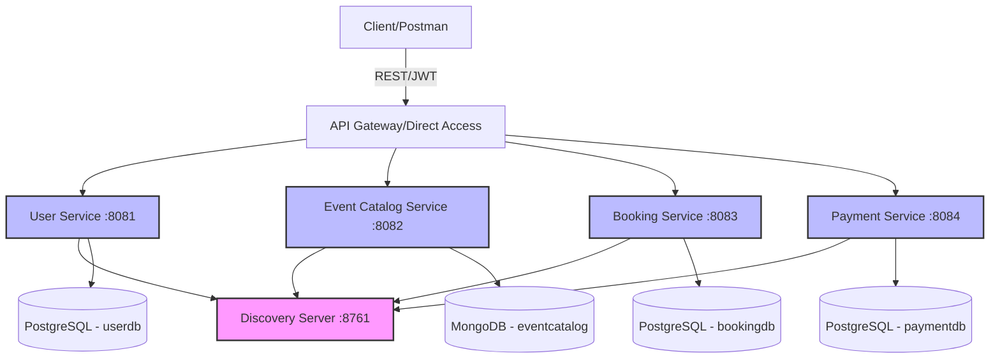
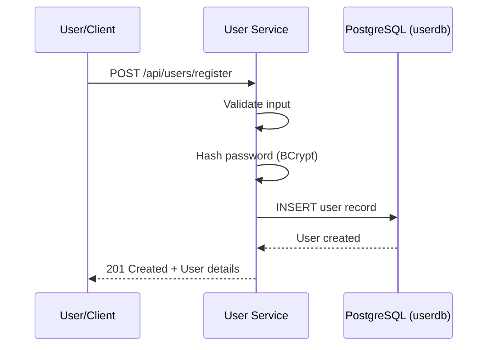
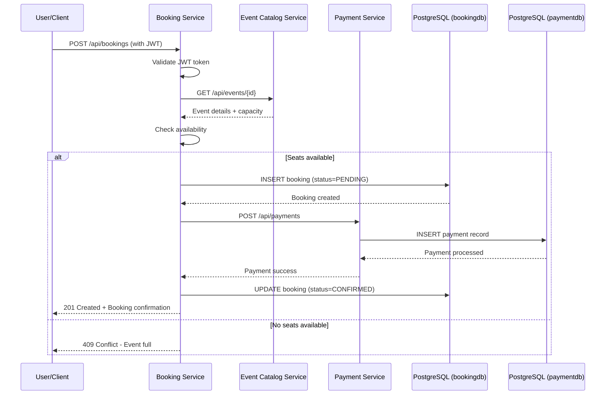
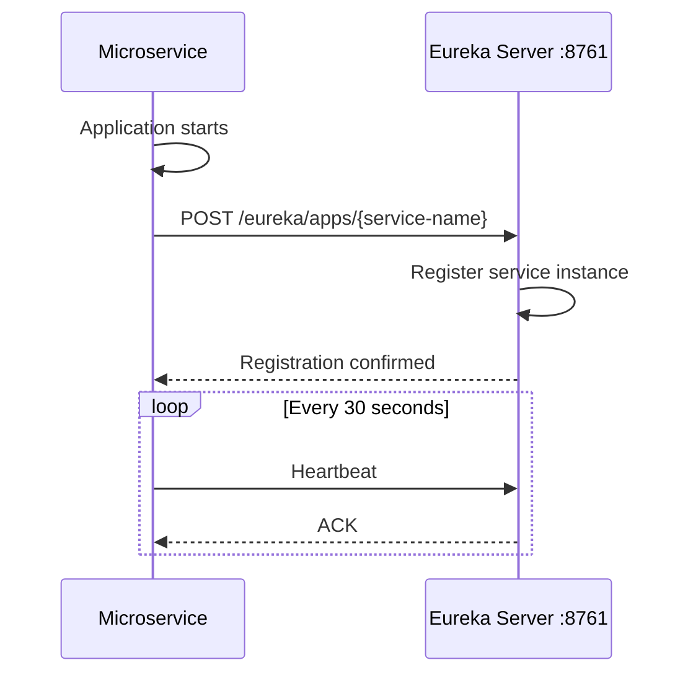
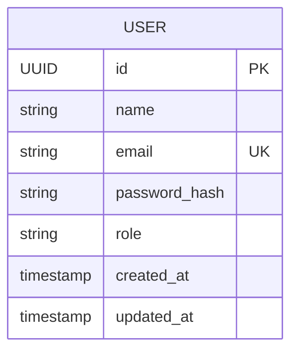
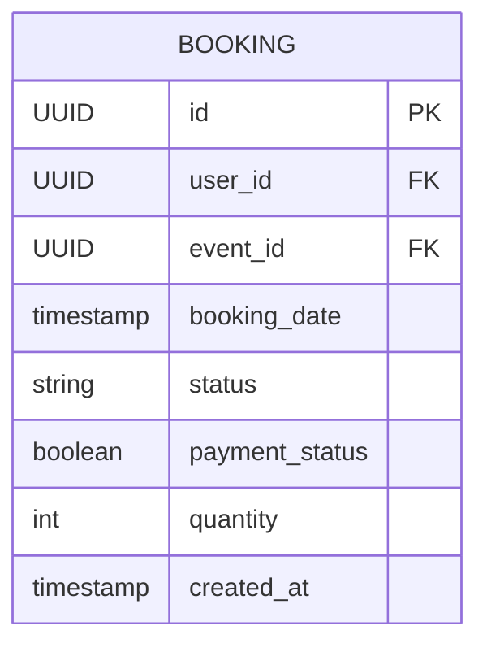
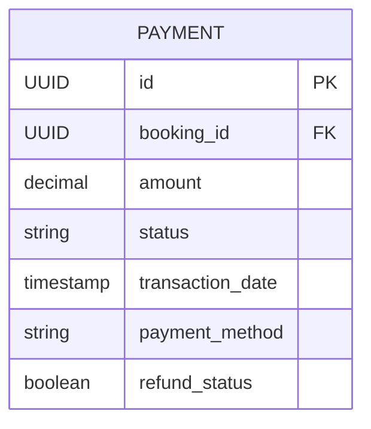
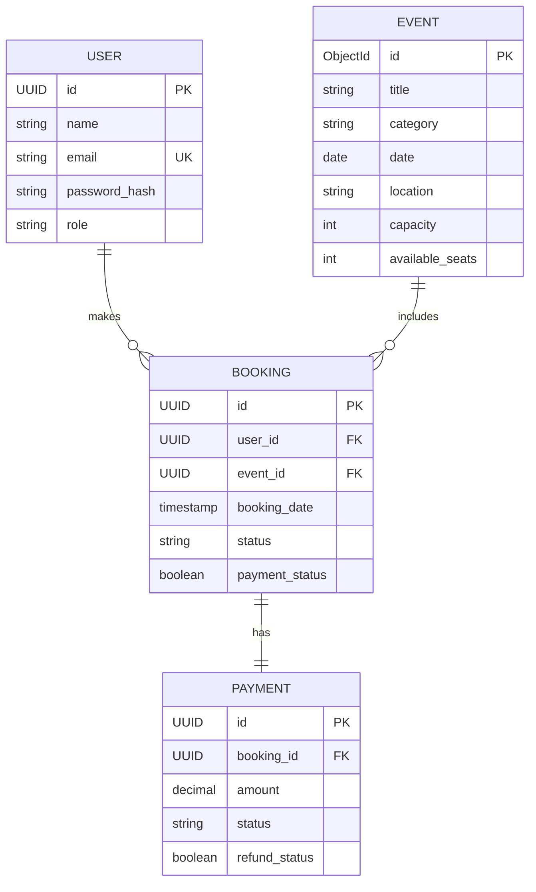

# System Design Document (SDD) — COMP 301: Software Architectures and Tools

**Project:** EventPlanner Microservices  
**Course:** COMP 301 - Software Architectures and Tools  
**Semester:** Fall 2025  
**Date:** January 12, 2026  
**GitHub Repository:** https://github.com/KarSim144/Comp301-Microservices-Project  
**Render Deployment:** [https://payment-service-d3i5.onrender.com and https://booking-service-et67.onrender.com and https://user-service-fcyq.onrender.com and https://event-catalog-service-uik6.onrender.com]

---

## 1. Executive Summary

EventPlanner is a modern, microservices-based event planning application designed to facilitate event organization, user management, ticket booking, and payment processing. The system leverages Spring Boot and follows a distributed architecture pattern where each microservice handles a distinct business capability.

The application consists of five core microservices: User Service for authentication and user management, Event Catalog Service for event creation and discovery, Booking Service for ticket reservations, Payment Service for financial transactions, and a Discovery Server using Eureka for service registry and discovery.

**Target Users:** Event organizers, event attendees, and system administrators.

**Deployment:** The application is deployed on Render.com as independent web services, utilizing PostgreSQL (via Neon) and MongoDB Atlas for data persistence. Each service communicates via RESTful APIs secured with JWT authentication.

---

## 2. Goals & Non-Functional Requirements (NFRs)

### System Goals
- Provide a scalable platform for event management and booking
- Enable independent deployment and scaling of services
- Ensure secure authentication and authorization across services
- Maintain high availability and fault tolerance

### Non-Functional Requirements

| Requirement | Target | Implementation |
|-------------|--------|----------------|
| **Availability** | 99% uptime | Deployed on Render with health checks via Spring Actuator |
| **Scalability** | Handle 500+ concurrent users | Horizontal scaling enabled on Render, stateless services |
| **Performance** | API response time < 500ms | Optimized database queries, connection pooling |
| **Security** | JWT-based authentication | Spring Security with JWT tokens, secure password hashing |
| **Maintainability** | Modular architecture | Separate microservices with clear boundaries |
| **Data Retention** | Transaction logs for 90 days | Configured in database settings |

---

## 3. Scope and Requirements

### 3.1 Functional Requirements

1. **FR-1:** Users can register and create accounts (User Service)
2. **FR-2:** Users can authenticate using JWT tokens (User Service)
3. **FR-3:** Event organizers can create, update, and delete events (Event Catalog Service)
4. **FR-4:** Users can search and filter events by criteria (Event Catalog Service)
5. **FR-5:** Users can book tickets for available events (Booking Service)
6. **FR-6:** Users can cancel existing bookings (Booking Service)
7. **FR-7:** System processes payments for bookings (Payment Service)
8. **FR-8:** System can issue refunds for cancelled bookings (Payment Service)
9. **FR-9:** All services register with Eureka for service discovery (Discovery Server)
10. **FR-10:** Health monitoring via Spring Actuator endpoints

### 3.2 Constraints & Assumptions

- Must be implemented with Spring Boot 3.2+ and Java 21
- Deploy to Render.com as independent services
- Use PostgreSQL for relational data (User, Booking, Payment)
- Use MongoDB for semi-structured data (Event Catalog)
- CORS is disabled for development (must be enabled for production)
- JWT secret must be managed as environment variable
- Each microservice maintains its own database

---

## 4. High-Level Architecture

### Architecture Diagram



### Architecture Pattern
- **Pattern:** Microservices Architecture
- **Service Discovery:** Netflix Eureka
- **Communication:** Synchronous REST APIs
- **Authentication:** JWT tokens issued by User Service
- **Database Strategy:** Database per service

---

## 5. Component Design (Per Service)

### 5.1 Discovery Server (Eureka)

**Purpose:** Service registry and discovery for all microservices

**Responsibilities:**
- Register all microservices on startup
- Provide service location information
- Enable load balancing and failover
- Health monitoring dashboard

**Port:** 8761

**Configuration:**
```properties
eureka.client.register-with-eureka=false
eureka.client.fetch-registry=false
```

**Dependencies:** None (standalone)

**Scaling Strategy:** Single instance sufficient for development; cluster for production

---

### 5.2 User Service

**Purpose:** User authentication, registration, and profile management

**Responsibilities:**
- User registration with password hashing
- User authentication and JWT token generation
- Role-based access control (RBAC)
- User profile management

**Port:** 8081

**Exposed APIs:**
| Method | Endpoint | Description | Auth Required |
|--------|----------|-------------|---------------|
| POST | `/api/users/register` | Register new user | No |
| POST | `/api/users/login` | Authenticate user, return JWT | No |
| GET | `/api/users/{id}` | Get user profile | Yes (JWT) |
| PUT | `/api/users/{id}` | Update user profile | Yes (JWT) |

**Data Storage:**
- Database: PostgreSQL (`userdb`)
- Key Tables: `users` (id, name, email, password_hash, role, created_at)

**Dependencies:**
- Discovery Server (Eureka)

**Security:**
- Passwords hashed using BCrypt
- JWT tokens with configurable expiration
- Spring Security configuration

**Scaling Strategy:** Stateless, horizontally scalable

---

### 5.3 Event Catalog Service

**Purpose:** Manage event listings, search, and filtering

**Responsibilities:**
- Create, read, update, delete (CRUD) operations for events
- Search events by query string
- Filter events by category, date, location
- Manage event capacity and availability

**Port:** 8082

**Exposed APIs:**
| Method | Endpoint | Description | Auth Required |
|--------|----------|-------------|---------------|
| POST | `/api/events` | Create new event | Yes (JWT) |
| GET | `/api/events` | List all events | No |
| GET | `/api/events/{id}` | Get event details | No |
| GET | `/api/events/search?query=...` | Search events | No |
| PUT | `/api/events/{id}` | Update event | Yes (JWT) |
| DELETE | `/api/events/{id}` | Delete event | Yes (JWT) |

**Data Storage:**
- Database: MongoDB (`eventcatalog`)
- Collections: `events` (id, title, description, category, date, location, capacity, organizer_id)

**Dependencies:**
- Discovery Server (Eureka)
- User Service (for organizer validation)

**Scaling Strategy:** Stateless, horizontally scalable, MongoDB Atlas for managed scaling

---

### 5.4 Booking Service

**Purpose:** Handle ticket booking, cancellation, and confirmation

**Responsibilities:**
- Create bookings for available events
- Validate event capacity before booking
- Cancel bookings and update availability
- Track booking status and confirmation
- Coordinate with Payment Service

**Port:** 8083

**Exposed APIs:**
| Method | Endpoint | Description | Auth Required |
|--------|----------|-------------|---------------|
| POST | `/api/bookings` | Create new booking | Yes (JWT) |
| GET | `/api/bookings` | List all bookings | Yes (JWT, Admin) |
| GET | `/api/bookings/user/{userId}` | Get user's bookings | Yes (JWT) |
| GET | `/api/bookings/{id}` | Get booking details | Yes (JWT) |
| DELETE | `/api/bookings/{id}` | Cancel booking | Yes (JWT) |

**Data Storage:**
- Database: PostgreSQL (`bookingdb`)
- Key Tables: `bookings` (id, user_id, event_id, booking_date, status, payment_status, quantity)

**Dependencies:**
- Discovery Server (Eureka)
- Event Catalog Service (check availability)
- Payment Service (process payment)

**Scaling Strategy:** Stateless, horizontally scalable

---

### 5.5 Payment Service

**Purpose:** Process payments and refunds for bookings

**Responsibilities:**
- Process payment transactions
- Store payment records
- Handle refunds for cancelled bookings
- Track transaction history
- Validate payment details

**Port:** 8084

**Exposed APIs:**
| Method | Endpoint | Description | Auth Required |
|--------|----------|-------------|---------------|
| POST | `/api/payments` | Process new payment | Yes (JWT) |
| GET | `/api/payments` | List all payments | Yes (JWT, Admin) |
| GET | `/api/payments/{id}` | Get payment details | Yes (JWT) |
| POST | `/api/payments/{id}/refund` | Process refund | Yes (JWT) |

**Data Storage:**
- Database: PostgreSQL (`paymentdb`)
- Key Tables: `payments` (id, booking_id, amount, status, transaction_date, payment_method, refund_status)

**Dependencies:**
- Discovery Server (Eureka)
- Booking Service (validate booking)

**Scaling Strategy:** Stateless, horizontally scalable

---

## 6. Sequence Diagrams

### 6.1 User Registration Flow



### 6.2 Ticket Booking Flow



### 6.3 Service Discovery Registration



---

## 7. Data Model

### 7.1 User Service - PostgreSQL Schema



**Table: users**
```sql
CREATE TABLE users (
    id UUID PRIMARY KEY DEFAULT gen_random_uuid(),
    name VARCHAR(100) NOT NULL,
    email VARCHAR(100) UNIQUE NOT NULL,
    password_hash VARCHAR(255) NOT NULL,
    role VARCHAR(20) DEFAULT 'USER',
    created_at TIMESTAMP DEFAULT CURRENT_TIMESTAMP,
    updated_at TIMESTAMP DEFAULT CURRENT_TIMESTAMP
);
```

---

### 7.2 Event Catalog Service - MongoDB Schema

**Collection: events**
```json
{
  "_id": "ObjectId",
  "title": "String",
  "description": "String",
  "category": "String",
  "date": "ISODate",
  "location": "String",
  "capacity": "Number",
  "available_seats": "Number",
  "organizer_id": "String",
  "created_at": "ISODate",
  "updated_at": "ISODate"
}
```

---

### 7.3 Booking Service - PostgreSQL Schema



**Table: bookings**
```sql
CREATE TABLE bookings (
    id UUID PRIMARY KEY DEFAULT gen_random_uuid(),
    user_id UUID NOT NULL,
    event_id UUID NOT NULL,
    booking_date TIMESTAMP DEFAULT CURRENT_TIMESTAMP,
    status VARCHAR(20) DEFAULT 'PENDING',
    payment_status BOOLEAN DEFAULT FALSE,
    quantity INT DEFAULT 1,
    created_at TIMESTAMP DEFAULT CURRENT_TIMESTAMP
);
```

---

### 7.4 Payment Service - PostgreSQL Schema



**Table: payments**
```sql
CREATE TABLE payments (
    id UUID PRIMARY KEY DEFAULT gen_random_uuid(),
    booking_id UUID NOT NULL UNIQUE,
    amount DECIMAL(10,2) NOT NULL,
    status VARCHAR(20) DEFAULT 'PENDING',
    transaction_date TIMESTAMP DEFAULT CURRENT_TIMESTAMP,
    payment_method VARCHAR(50),
    refund_status BOOLEAN DEFAULT FALSE
);
```

---

### 7.5 Complete System ER Diagram



---

## 8. Security & Operational Concerns

### Authentication & Authorization
- **JWT Tokens:** Issued by User Service upon successful login
- **Token Structure:** Header.Payload.Signature (HS256 algorithm)
- **Token Expiration:** Configurable via `JWT_EXPIRATION` environment variable
- **Password Security:** BCrypt hashing with salt rounds = 10
- **Authorization:** Role-based access control (USER, ADMIN, ORGANIZER)

### Transport Security
- **HTTPS:** Enforced on Render.com deployment
- **TLS:** Minimum version 1.2
- **CORS:** Currently disabled for development; must enable for production with specific origins

### Secrets Management
All sensitive data managed via Render environment variables:
```
JWT_SECRET=<random_256_bit_secret>
SPRING_DATASOURCE_PASSWORD=<db_password>
SPRING_DATA_MONGODB_URI=<mongo_connection_string>
```

### Monitoring & Logging
- **Health Checks:** Spring Actuator endpoints `/actuator/health`
- **Service Status:** Eureka dashboard at `:8761`
- **Logging:** Application logs via stdout, collected by Render
- **Metrics:** Available via Render metrics dashboard

### Error Handling
- Standardized error responses with HTTP status codes
- Exception handlers in each service
- Validation on all API inputs

---

## 9. Deployment Architecture

### Render.com Deployment Strategy

Each microservice deployed as independent web service:

| Service | Port | Instance Type | Database |
|---------|------|---------------|----------|
| Discovery Server | 8761 | Web Service | None |
| User Service | 8081 | Web Service | Neon PostgreSQL |
| Event Catalog | 8082 | Web Service | MongoDB Atlas |
| Booking Service | 8083 | Web Service | Neon PostgreSQL |
| Payment Service | 8084 | Web Service | Neon PostgreSQL |

### Environment Configuration

**Common Variables (all services):**
```
SPRING_PROFILES_ACTIVE=prod
EUREKA_CLIENT_SERVICEURL_DEFAULTZONE=https://<discovery-server>.onrender.com/eureka/
```

**User Service:**
```
SPRING_DATASOURCE_URL=jdbc:postgresql://<neon-host>:5432/userdb
SPRING_DATASOURCE_USERNAME=<username>
SPRING_DATASOURCE_PASSWORD=<password>
JWT_SECRET=<jwt_secret>
```

**Event Catalog Service:**
```
SPRING_DATA_MONGODB_URI=mongodb+srv://<user>:<pass>@<cluster>.mongodb.net/eventcatalog
```

### Build Command
```bash
mvn clean package -DskipTests
```

### Start Command
```bash
java -jar target/<service-name>-0.0.1-SNAPSHOT.jar
```

---

## 10. Testing Strategy

### 10.1 Unit Testing
- **Framework:** JUnit 5, Mockito
- **Coverage Target:** 70% minimum
- **Focus Areas:** Service layer business logic, repository operations

**Example Test (User Service):**
```java
@Test
void testUserRegistration() {
    User user = new User("John Doe", "john@example.com", "password");
    when(userRepository.save(any(User.class))).thenReturn(user);
    
    User result = userService.register(user);
    
    assertNotNull(result);
    assertEquals("john@example.com", result.getEmail());
    verify(userRepository, times(1)).save(any(User.class));
}
```

### 10.2 Integration Testing
- **Tool:** Postman Collections
- **Test Scenarios:**
  1. User registration and login
  2. Event creation and retrieval
  3. Complete booking flow (event → booking → payment)
  4. Service discovery registration

### 10.3 End-to-End Testing
- **Environment:** Deployed Render services
- **Test Flow:**
  1. Register user → Receive JWT
  2. Create event → Verify in database
  3. Book ticket → Verify payment
  4. Cancel booking → Verify refund

### 10.4 Health Checks
All services expose actuator endpoints:
```
GET /actuator/health
Response: {"status": "UP"}
```

---

## 11. API Documentation

### User Service APIs

**POST /api/users/register**
```json
Request:
{
  "name": "John Doe",
  "email": "john@example.com",
  "password": "SecurePass123"
}

Response (201):
{
  "id": "uuid",
  "name": "John Doe",
  "email": "john@example.com",
  "role": "USER"
}
```

**POST /api/users/login**
```json
Request:
{
  "email": "john@example.com",
  "password": "SecurePass123"
}

Response (200):
{
  "token": "eyJhbGciOiJIUzI1NiIsInR5cCI6IkpXVCJ9...",
  "type": "Bearer",
  "id": "uuid",
  "email": "john@example.com"
}
```

### Event Catalog APIs

**POST /api/events** (Requires JWT)
```json
Request:
{
  "title": "Tech Conference 2026",
  "description": "Annual technology conference",
  "category": "Technology",
  "date": "2026-06-15T09:00:00",
  "location": "Istanbul Convention Center",
  "capacity": 500
}

Response (201):
{
  "id": "event_id",
  "title": "Tech Conference 2026",
  "availableSeats": 500
}
```

**GET /api/events/search?query=tech**
```json
Response (200):
[
  {
    "id": "event_id",
    "title": "Tech Conference 2026",
    "category": "Technology",
    "date": "2026-06-15T09:00:00",
    "location": "Istanbul Convention Center",
    "availableSeats": 500
  }
]
```

### Booking APIs

**POST /api/bookings** (Requires JWT)
```json
Request:
Headers: Authorization: Bearer <token>
{
  "eventId": "event_id",
  "quantity": 2
}

Response (201):
{
  "id": "booking_id",
  "userId": "user_id",
  "eventId": "event_id",
  "status": "CONFIRMED",
  "paymentStatus": true
}
```

**GET /api/bookings/user/{userId}** (Requires JWT)
```json
Response (200):
[
  {
    "id": "booking_id",
    "eventId": "event_id",
    "bookingDate": "2026-01-12T14:30:00",
    "status": "CONFIRMED",
    "quantity": 2
  }
]
```

### Payment APIs

**POST /api/payments** (Requires JWT)
```json
Request:
{
  "bookingId": "booking_id",
  "amount": 150.00,
  "paymentMethod": "CREDIT_CARD"
}

Response (201):
{
  "id": "payment_id",
  "bookingId": "booking_id",
  "amount": 150.00,
  "status": "COMPLETED",
  "transactionDate": "2026-01-12T14:35:00"
}
```

---

## 12. Lessons Learned & Challenges

### Challenges Faced
1. **Service Discovery:** Initial configuration of Eureka required correct `defaultZone` URL formatting
2. **Database Connections:** Managing different databases (PostgreSQL vs MongoDB) with proper connection pooling
3. **JWT Configuration:** Ensuring JWT secret consistency across services
4. **CORS Issues:** Disabled for development but requires proper configuration for production

### Solutions Implemented
1. Used environment variables for all configuration
2. Implemented health checks for early failure detection
3. Separated databases per service for true microservice isolation
4. Documented all API endpoints with Postman collections

### Future Improvements
1. Implement API Gateway (Spring Cloud Gateway)
2. Add message queue for async communication (RabbitMQ/Kafka)
3. Implement distributed tracing (Zipkin/Sleuth)
4. Add caching layer (Redis)
5. Enable CORS with specific allowed origins
6. Implement rate limiting
7. Add comprehensive logging with ELK stack

---

## 13. References & Resources

- **Spring Boot Documentation:** https://spring.io/projects/spring-boot
- **Spring Cloud Netflix:** https://spring.io/projects/spring-cloud-netflix
- **PostgreSQL on Neon:** https://neon.tech/
- **MongoDB Atlas:** https://www.mongodb.com/atlas
- **Render Deployment Guide:** https://render.com/docs
- **JWT.io:** https://jwt.io/
- **Project Repository:** https://github.com/KarSim144/Comp301-Microservices-Project

---

## 14. Conclusion

The EventPlanner microservices application successfully demonstrates modern distributed system architecture using Spring Boot. The system achieves loose coupling through independent services, each with its own database and clear responsibility. The deployment on Render.com proves the system's production readiness and scalability.

The project fulfills all COMP 301 requirements including service discovery, RESTful communication, security implementation, and cloud deployment. The architecture supports future enhancements and demonstrates best practices in microservices design.

---

**Document Version:** 1.0  
**Last Updated:** January 12, 2026  
**Status:** Final Submission
